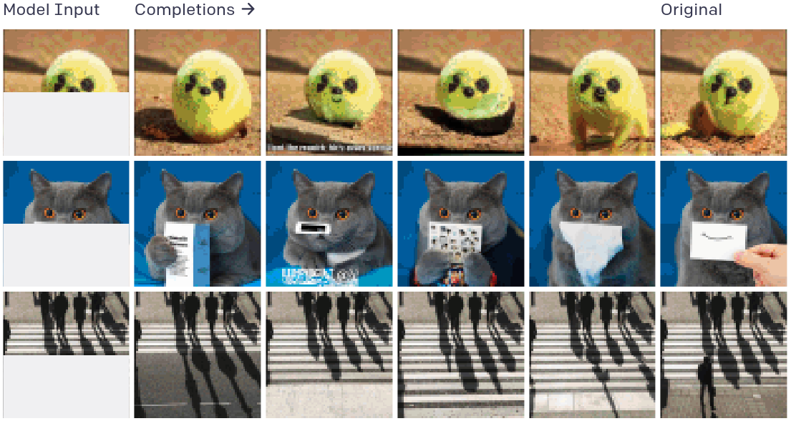

# imageGPT - Generative Pretraining From Pixels

Presentation available at [https://burnpiro.github.io/igpt-presentation/#/](https://burnpiro.github.io/igpt-presentation/#/). Code available at [https://github.com/burnpiro/image-gpt](https://github.com/burnpiro/image-gpt). Presentation based on the ["Generative Pretraining From Pixels"](https://cdn.openai.com/papers/Generative_Pretraining_from_Pixels_V2.pdf) paper from OpenAI ICML2020.

## Summary

_"Generative Pretraining From Pixels"_ paper introduces the idea of using transformer architecture with image as an input. Researchers from OpenAI were trying to check if pretraining large transformer models using only unsupervised approach is useful for further classification tasks.

### Pretraining and problem with the input size

There was 2 solutions for pretraining. The first one used standard autoregressive approach  

### Models:

- __iGPT-XL__ 60 layers, 6.8*10^12 parameters, 3072 embedding size
- __iGPT-L__ 48 layers, 1.4*10^12 parameters, 1536 embedding size
- __iGPT-M__ 36 layers, 455*10^9 parameters, 1024 embedding size
- __iGPT-S__ 24 layers, 76*10^9 parameters, 512 embedding size

### [RevealJS](https://revealjs.com/) presentation template

This presentation template is using RevealJS library with additional plugins:

- [`RevealNotes`](https://revealjs.com/speaker-view/) - Speaker notes, Author: Hakim El Hattab
- [`RevealMarkdown`](https://revealjs.com/markdown/) - Markdown support, Author: Hakim El Hattab
- [`RevealHighlight`](https://revealjs.com/code/) - Code syntax highlighting, Author: Hakim El Hattab
- [`RevealMath`](https://revealjs.com/math/) - Latex support, Author: Hakim El Hattab
- [`RevealZoom`](https://revealjs.com/plugins/#built-in-plugins) - Alt + click zoom, Author: Hakim El Hattab
- [`RevealMenu`](https://github.com/denehyg/reveal.js-menu) - Latex support, Author: Greg Denehy
- [`RevealPointer`](https://github.com/burnpiro/reveal-pointer) - Mouse pointer, Author: Kemal Erdem

### License
MIT licensed
Copyright (C) 2021: [Kemal Erdem](https://github.com/burnpiro)