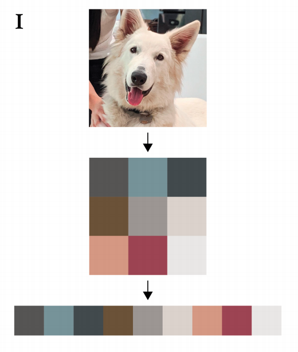
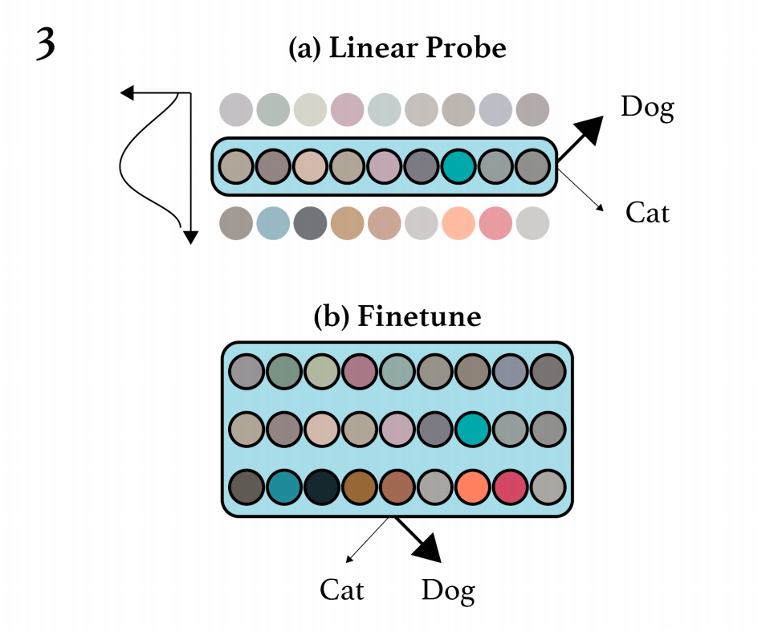
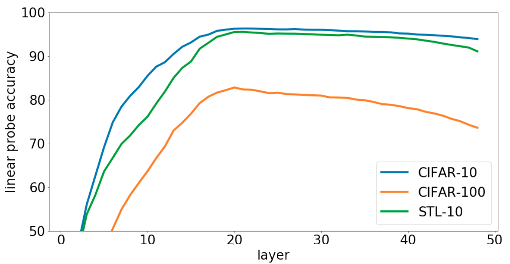

# imageGPT - Generative Pretraining From Pixels

Presentation available at [https://burnpiro.github.io/igpt-presentation/#/](https://burnpiro.github.io/igpt-presentation/#/). Code available at [https://github.com/burnpiro/image-gpt](https://github.com/burnpiro/image-gpt). Presentation based on the ["Generative Pretraining From Pixels"](https://cdn.openai.com/papers/Generative_Pretraining_from_Pixels_V2.pdf) paper from OpenAI ICML2020.

## Summary

_"Generative Pretraining From Pixels"_ paper introduces the idea of using transformer architecture with image as an input. Researchers from OpenAI were trying to check if pretraining large transformer models using only unsupervised approach is useful for further classification tasks.

### Pretraining and problem with the input size

There was 2 solutions for pretraining. The first one used standard autoregressive objective, the second one used BERT objectives. Because of quadratic complexity, authors weren't able to use full 256x256x3 image as an input. They've decided to create 9bit color encoding and resize each image into 32x32px (48x48px or 64x64px) image with colors mapped using k-means algorithm (my implementation with real world example available at [9bit color example Notebook](https://github.com/burnpiro/image-gpt/blob/master/9bit%20color%20coding%20example.ipynb)). 

### Models:

- __iGPT-XL__ 60 layers, 6.8*10^12 parameters, 3072 embedding size
- __iGPT-L__ 48 layers, 1.4*10^12 parameters, 1536 embedding size
- __iGPT-M__ 36 layers, 455*10^9 parameters, 1024 embedding size
- __iGPT-S__ 24 layers, 76*10^9 parameters, 512 embedding size

### Classification training

After pretraining is done, there are two approaches to tune the model for classification task:

- __Fine-tunning__
- __Linear Probing__

Fine-tunning using the whole model and tunes all available layers. Linear probing is a lot more interesting especially if we look on the results per layer:

Best results are achieved not by fine-tunning last layers, but rather the "middlish" ones. The authors reason that this is a result of generative models operate in two phases:

- Phase 1: building global image representation by gathering context information about the image
- Phase 2: this is a specialization phase where contextualized input is used for given taks (either autoregression or bert objective)

### Interesting findings

There is one more interesting finding from this paper. Larger models perform better on the classification taks even if they have the same validation loss on original generative objective. That means they are able to learn better representation of the image which is not reflected in generative loss.

X-axis is decrementing!!!

This paper introduced very important idea that transformers could be used with images and are able to learn really good representation of each image even without the labels.

### [RevealJS](https://revealjs.com/) presentation template

This presentation template is using RevealJS library with additional plugins:

- [`RevealNotes`](https://revealjs.com/speaker-view/) - Speaker notes, Author: Hakim El Hattab
- [`RevealMarkdown`](https://revealjs.com/markdown/) - Markdown support, Author: Hakim El Hattab
- [`RevealHighlight`](https://revealjs.com/code/) - Code syntax highlighting, Author: Hakim El Hattab
- [`RevealMath`](https://revealjs.com/math/) - Latex support, Author: Hakim El Hattab
- [`RevealZoom`](https://revealjs.com/plugins/#built-in-plugins) - Alt + click zoom, Author: Hakim El Hattab
- [`RevealMenu`](https://github.com/denehyg/reveal.js-menu) - Latex support, Author: Greg Denehy
- [`RevealPointer`](https://github.com/burnpiro/reveal-pointer) - Mouse pointer, Author: Kemal Erdem

### License
MIT licensed
Copyright (C) 2021: [Kemal Erdem](https://github.com/burnpiro)